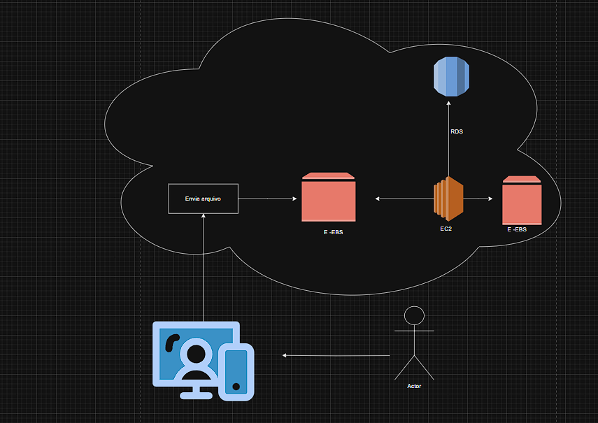

# 🌐 Gerenciamento de Instâncias EC2 na AWS

## ✨ Sobre este laboratório

Este laboratório foi uma oportunidade incrível para mergulhar de verdade no universo da AWS, especialmente no gerenciamento de instâncias EC2. Mais do que seguir passos técnicos, foi um exercício de entender como os serviços se conectam, como cada decisão impacta a infraestrutura e como documentar tudo de forma clara e útil.

Criei este repositório como um espaço para reunir tudo o que aprendi  não só os comandos e configurações, mas também os **insights que só vêm quando a gente põe a mão na massa**.

---

## 🎯 O que aprendi na prática

O Amazon EC2 (Elastic Compute Cloud) é um dos serviços mais fundamentais da AWS. Ele permite criar servidores virtuais sob demanda, com total controle sobre o sistema operacional, armazenamento, rede e segurança.
Durante o laboratório, percebi que o EC2 é como um “computador na nuvem”  mas com muito mais flexibilidade. Você escolhe tudo: desde a imagem do sistema (AMI), até o tipo de instância, o volume de armazenamento, e as regras de acesso.
O que mais me chamou atenção:
- Elasticidade: posso iniciar, parar, reiniciar ou terminar instâncias conforme a necessidade, sem depender de hardware físico.
- Escalabilidade: é possível aumentar ou reduzir recursos com poucos cliques, o que é essencial para aplicações que crescem rápido.
- Integração com outros serviços: EC2 conversa facilmente com EBS, CloudWatch, IAM, S3 e muitos outros — o que permite montar arquiteturas completas e automatizadas.
- Controle total: diferente de serviços gerenciados, o EC2 me dá liberdade para configurar tudo do zero, o que é ótimo para aprender e testar.
- 
Esse laboratório me ajudou a entender que EC2 não é só sobre “ligar uma máquina”, mas sim sobre construir ambientes sob medida, com segurança, desempenho e escalabilidade.

### 🔐 Segurança é prioridade
Configurar Security Groups foi um dos pontos mais importantes. Aprendi que abrir portas demais pode comprometer a segurança, e que é essencial limitar o acesso por IP e protocolo. Isso me fez pensar como a segurança na nuvem é **ativa e estratégica**, não só técnica.

### 💾 Associar volumes EBS
Conectar um volume EBS à instância foi um divisor de águas. Entendi como separar o armazenamento do processamento traz flexibilidade e persistência. Aprendi a montar, formatar e usar o volume como se fosse um disco local  e isso me deu uma visão mais clara de como **infraestrutura em nuvem simula o físico, mas com muito mais controle**.

---

## 💡 Reflexões finais

Esse laboratório me mostrou que trabalhar com EC2 não é só sobre “ligar uma máquina virtual”. É sobre **entender a arquitetura, pensar em segurança, planejar armazenamento e acompanhar o desempenho**. E acima de tudo, é sobre aprender a pensar como uma pessoa que constrói soluções na nuvem — com responsabilidade, clareza e propósito.

